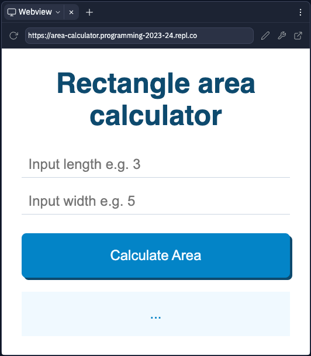

# Programming Paradigms - Rectangle Area Calculator

## Getting started

Open [index.html](index.html) and click the "► Run" button at the top of your screen. You should see a "Webview" tab open showing the screen below:

> **NOTE** - you may need to resize your panel to see  the whole layout.

### Using the application

1. Click into the 'Input length' and 'Input width' fields, and type a number in each.
2. Click 'Calculate Area'
3. The area of a rectangle with the dimensions you submitted will be generated at the bottom of the window.

## Assignment 1 Task - Programming 

Produce a formal presentation (with supporting notes) that explores the features and characteristics of the three different programming paradigms at work in this application.

 - Event Driven
 - Object Oriented
 - Procedural

The application source code implements all three paradigms - you will need to explain where they are, and what purpose they serve in the program.

> ### Your presentation should include:
> 
> - a brief **explanation** about what the application is and what it does
> - a **general** discussion of the three code paradigms, with specific reference to their characteristics and how each one is related
> - a **comparison** of how the three programming paradigms have been used in the application source code
> - a **critical evaluation** of how the source code implements all three paradigms in terms of code structure and characteristics.

---

# 🦦 Good luck!
